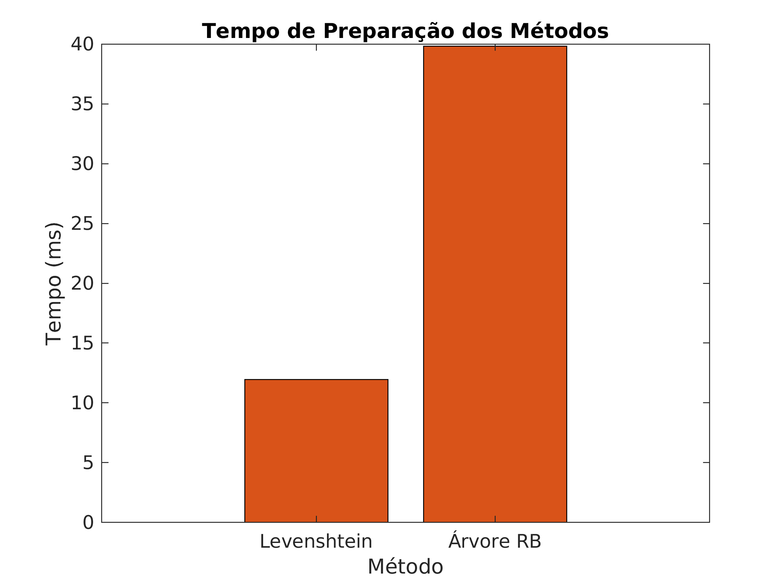
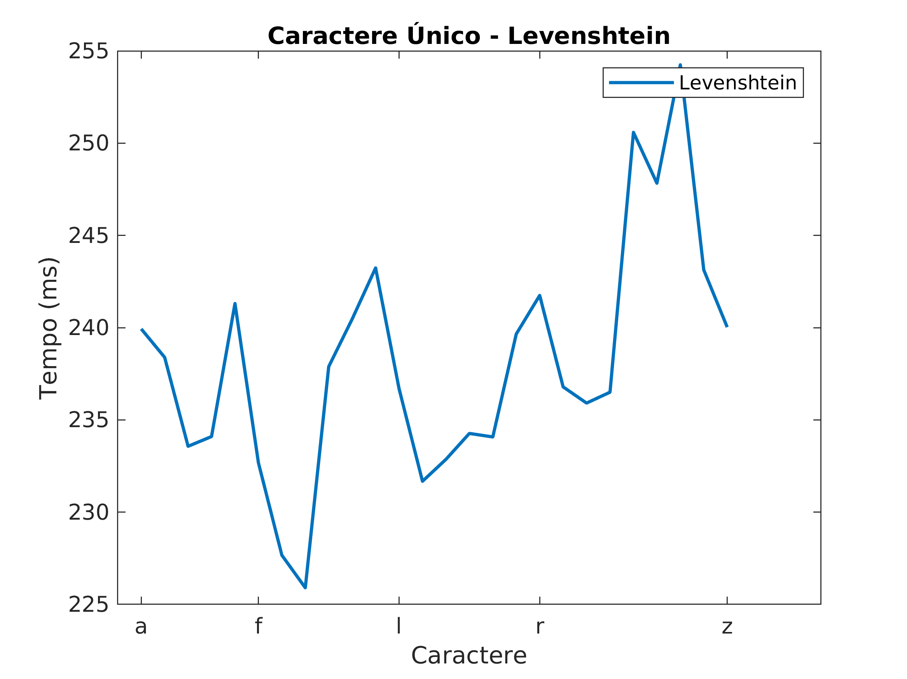
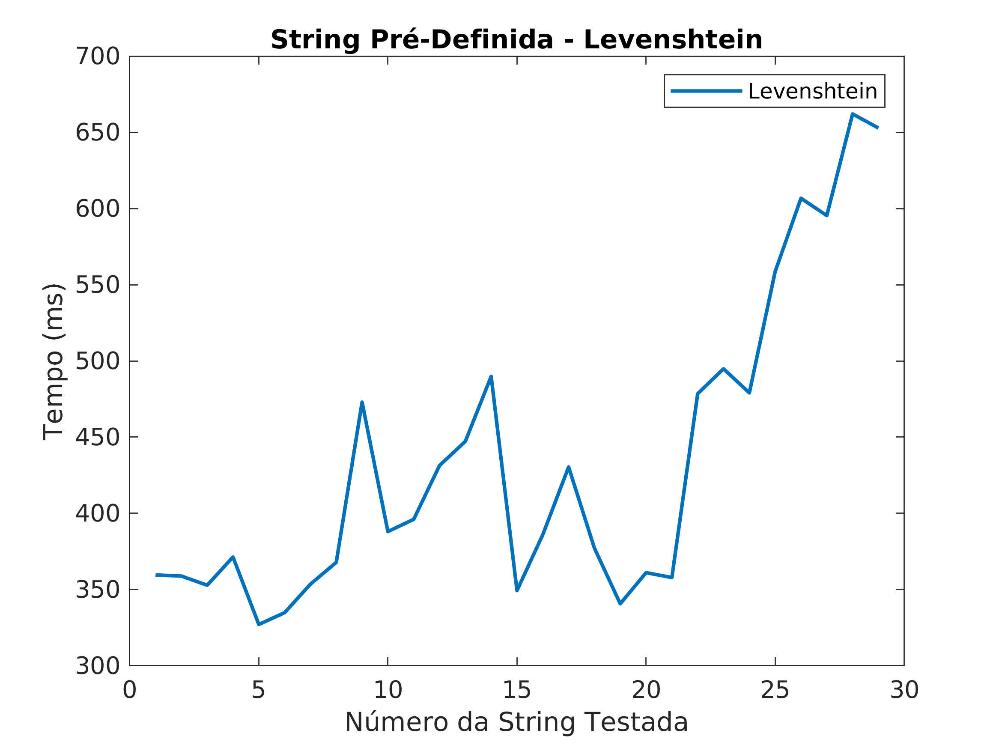
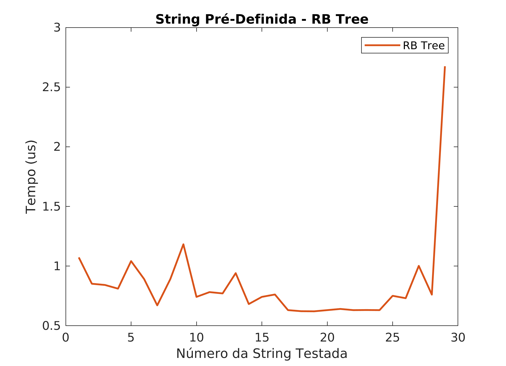
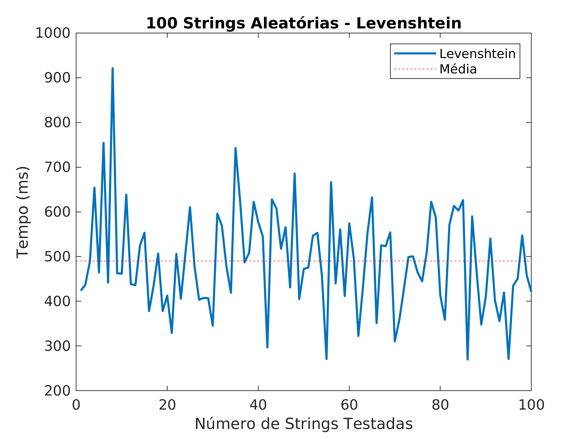
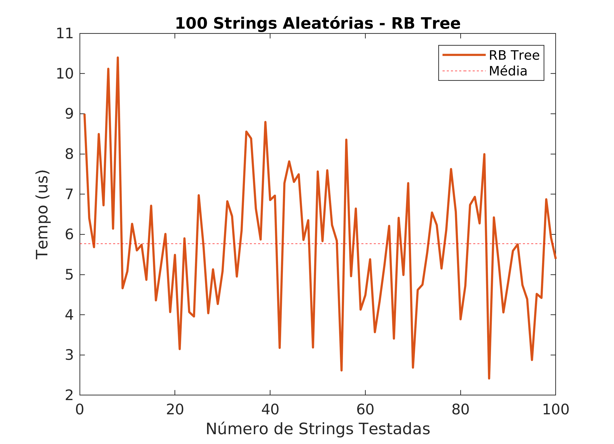

# Exame Final CTC-34

- Arthur Costa Stevenson Mota
- Eduardo de Moura Simplício
- Matheus Silva Ramos

O Exame Final da disciplina CTC-34 consiste em realizar a implementação de um *auto-complete* usando diferentes algoritmos, e então realizar comparações entre eles. Nesse caso, foram feitas as duas implementações obrigatórias, sendo elas um Autômato de Levenshtein, e um Transdutor de Estado Finito e, para a implementação opcional, foi escolhida a Árvore Rubro-Negra.
A seguir, estão os testes realizados para comparar os três diferentes algoritmos em diferentes contextos.

## Análise do Dicionário Usado

Para o estudo da eficiência do *auto-complete*, foi utilizado o dicionário disponibilizado juntamente ao Linux, para o Inglês Americano. Extraindo-se as palavras nele presente, e tomando as suas primeiras letras, tem-se que o alfabeto considerado é constituído por:
> `a`, `b`, `c`, `d`, `e`, `f`, `g`, `h`, `i`, `j`, `k`, `l`, `m`, `n`, `o`, `p`, `q`, `r`, `s`, `t`, `u`, `v`, `w`, `x`, `y`, `z`, `å`, `é`

Assim, na Figura 1, pode-se observar a distribuição das palavras no dicionário, de acordo com as suas primeiras letras.

|  |
|-|
|Figura 1: Distribuição de palavras no dicionário de acordo com as suas letras iniciais. Nota-se que as cinco letras com mais entradas, em ordem decrescente, são 'S', 'C', 'P', 'B' e 'M'.|

## Criação dos Dicionários

Antes de serem realizados quaiser testes quanto à velocidade de execução do algoritmo de *auto-complete*, os três diferentes algoritmos precisam completar uma etapa de preparação. No caso do Autômato de Levenshtein, isso significa importar as palavras do dicionário para uma lista que será percorrida, para a Árvore RB e o FST, criar as suas estruturas típicas, com base no dicionário de palavras especificado.

Assim, os tempos de preparação de cada um dos algoritmos estão apresentados nos gráficos das Figura 2 e 3. Analisando-se os resultados apresentados na figura, nota-se que o tempo de preparação do Autômato de Levenshtein é significativamente menor que os demais, o que se deve ao fato de esta etapa, para esse algoritmo, ser constituída simplesmente pela adição das *strings* do dicionário, sem que computações adicionais sejam feitas.

|  |
|-|
|Figura 2: Tempos de construção das estruturas do Autômato de Levenshtein e da Árvore Rubro-Negra. Nota-se que o Autômato de Levenshtein tem um tempo significativamente menor devido ao fato de simplesmente copiar o dicionário utilizado, sem realizar nenhuma operação para reduzi-lo.|

|  |
|-|
|Figura 3: Tempo de construção da estrutura do algoritmo FST. Percebe-se que, devido a quantidade elevada de operações que o método realiza, ele demora um tempo considerável para ficar pronto para a execução.|

## Testes com Caractere Único

Para uma comparação inicial, foram feitos testes de *auto-complete* utilizando-se apenas um caractere. Esses testes foram repetidos 10 vezes para cada letra, no intuito de criar um conjunto de dados representativo. Os gráficos abaixo apresentam o tempo médio de execução para cada letra dos três algoritmos implementados, Levenshtein considerando distância 1, Árvore Rubro-Negra, e FST. O alfabeto está distribuído em ordem no eixo X, com cada posição representando uma letra diferente.

||
| :-: |
|Figura 4: Tempos de execução para cada letra do alfabeto do autômato de Levenshtein com distância 1.|

||
| :-: |
|Figura 5: Tempos de execução para cada letra do alfabeto da árvore rubro-negra.|

||
| :-: |
|Figura 6: Tempos de execução para cada letra do alfabeto do FST.|

## Testes com String Fixa

Para a segunda bateria de testes, foram escolhidas algumas *strings* a mão, de maneira semi-aleatória, no intuito de comparar o desempenho dos algoritmos frente a uma entrada de comprimento constante e, ao final, analisar o efeito que o aumento no número de caracteres tem sobre o tempo de execução. Nesse contexto, as strings testadas estão listadas abaixo.

>`Apo`, `Bra`, `Bat`, `Bee`, `Bob`, `Cam`, `Car`, `Cat`, `Cro`, `Dao`, `Dog`, `Ele`, `Fra`, `Gar`, `Gre`, `Hog`, `Int`, `Joe`, `aa`, `aaa`, `aaaa`, `aaaaa`, `aaaaaa`, `aaaaaaa`, `aaaaaaaa`, `aaaaaaaaa`, `aaaaaaaaaa`, `aaaaaaaaaaa`, `aaaaaaaaaaaa`

||
| :-: |
|Figura 7: Tempos de execução para *strings* pré-definidas utilizando o Autômato de Levenshtein buscando palavras com distância 1.|

||
| :-: |
|Figura 8: Tempos de execução para *strings* pré-definidas utilizando a Árvore Rubro-Negra.|

||
| :-: |
|Figura 9: Tempos de execução para *strings* pré-definidas utilizando o FST.|

Comparando-se os três algoritmos, é possível constatar que o tempo de execução do Autômato de Levenshtein tende a crescer significativamente com o aumento do tamanho da *string*, o que se deve ao fato de o algoritmo se basear em uma verificação caractere a caractere da *string* analisada.

## Testes com String Aleatória

Para a última bateria de testes, foram selecionadas 100 *strings* do dicionário utilizado, de maneira aleatória, e foram removidos os últimos dois caracteres de cada uma, e estas foram passadas aos algoritmos como entradas. Esse teste serve como uma boa análise de casos de uso real do algoritmo, já que trata de palavras escolhidas aleatoriamente, que podem representar um usuário no meio da digitação.

||
| :-: |
|Figura 10: Tempos de execução do Autômato de Levenshtein com entrada de 100 *strings* selecionadas aleatoriamente do dicionário.|

||
| :-: |
|Figura 11: Tempos de execução da Árvore Rubro-Negra com entrada de 100 *strings* selecionadas aleatoriamente do dicionário.|

||
| :-: |
|Figura 12: Tempos de execução do FST com entrada de 100 *strings* selecionadas aleatoriamente do dicionário.|

## Análise de Memória

Para realizar a análise da memória utilizada pelos diferentes métodos, fez-se uso da ferramenta *valgrind*, que permite monitorar programas durante a sua execução, e verificar a quantidade de memória que é alocada por um programa, e se ela foi liberada corretamente ao final da execução do programa. Os testes realizados para os três algoritmos foram simplesmente a importação do dicionário, e criação da respectiva estrutura de dados.

```bash
% valgrind ./LevenshteinMemory_AgentTest                                                                                                                                                                         ✹ ✭
==227733== Memcheck, a memory error detector
==227733== Copyright (C) 2002-2017, and GNU GPL'd, by Julian Seward et al.
==227733== Using Valgrind-3.15.0 and LibVEX; rerun with -h for copyright info
==227733== Command: ./LevenshteinMemory_AgentTest
==227733== 
==227733== 
==227733== HEAP SUMMARY:
==227733==     in use at exit: 4,927,612 bytes in 103,098 blocks
==227733==   total heap usage: 103,816 allocs, 718 frees, 13,409,927 bytes allocated
==227733== 
==227733== LEAK SUMMARY:
==227733==    definitely lost: 48 bytes in 1 blocks
==227733==    indirectly lost: 4,927,564 bytes in 103,097 blocks
==227733==      possibly lost: 0 bytes in 0 blocks
==227733==    still reachable: 0 bytes in 0 blocks
==227733==         suppressed: 0 bytes in 0 blocks
==227733== Rerun with --leak-check=full to see details of leaked memory
==227733== 
==227733== For lists of detected and suppressed errors, rerun with: -s
==227733== ERROR SUMMARY: 0 errors from 0 contexts (suppressed: 0 from 0)
```

Pela análise da saída do *valgrind*, constata-se que o teste simples do algoritmo do Autômato de Levenshtein utilizou um total de 13.409.927 bytes de memória, o que corresponde a 12.78 MB.

```bash
% valgrind ./TreeMemory_AgentTest                                                                                                                                                                                ✹ ✭
==228037== Memcheck, a memory error detector
==228037== Copyright (C) 2002-2017, and GNU GPL'd, by Julian Seward et al.
==228037== Using Valgrind-3.15.0 and LibVEX; rerun with -h for copyright info
==228037== Command: ./TreeMemory_AgentTest
==228037== 
==228037== 
==228037== HEAP SUMMARY:
==228037==     in use at exit: 6,575,304 bytes in 103,098 blocks
==228037==   total heap usage: 104,512 allocs, 1,414 frees, 15,069,959 bytes allocated
==228037== 
==228037== LEAK SUMMARY:
==228037==    definitely lost: 64 bytes in 1 blocks
==228037==    indirectly lost: 6,575,240 bytes in 103,097 blocks
==228037==      possibly lost: 0 bytes in 0 blocks
==228037==    still reachable: 0 bytes in 0 blocks
==228037==         suppressed: 0 bytes in 0 blocks
==228037== Rerun with --leak-check=full to see details of leaked memory
==228037== 
==228037== For lists of detected and suppressed errors, rerun with: -s
==228037== ERROR SUMMARY: 0 errors from 0 contexts (suppressed: 0 from 0)
```

Novamente, pela análise da saída do *valgrind*, constata-se que o teste simples do algoritmo da Árvore Rubro-Negra utilizou um total de 15.069.959 bytes de memória, o que corresponde a 14.37 MB.

```bash
% valgrind
```

Finalmente, fazendo uso da última execução do *valgrind*, constata-se que o algoritmo do Finite State Transducer utilizou um total de .
