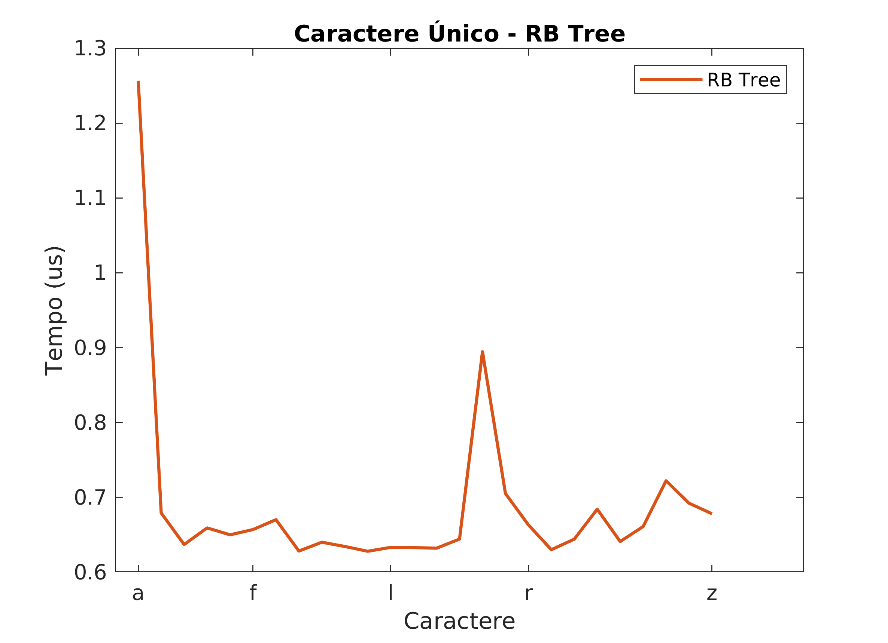

# Auto-Complete Implementation

- Arthur Costa Stevenson Mota
- Eduardo de Moura Simplício
- Matheus Silva Ramos

---

O Exame Final da disciplina CTC-34 consiste em realizar a implementação de um *auto-complete* usando diferentes algoritmos, e então realizar comparações entre eles. Nesse caso, foram feitas as duas implementações obrigatórias, sendo elas um Autômato de Levenshtein, e um Transdutor de Estado Finito e, para a implementação opcional, foi escolhida a Árvore Rubro-Negra.
A seguir, estão os testes realizados para comparar os três diferentes algoritmos em diferentes contextos.

## Criação dos Dicionários

Antes de serem realizados quaiser testes quanto à velocidade de execução do algoritmo de *auto-complete*, os três diferentes algoritmos precisam completar uma etapa de preparação. No caso do Autômato de Levenshtein, isso significa importar as palavras do dicionário para uma lista que será percorrida, para a Árvore RB e o FST, criar as suas estruturas típicas, com base no dicionário de palavras especificado.

Assim, os tempos de preparação de cada um dos algoritmos estão apresentados no gráfico da [Figura 1](preptime).

|  |
|-|
|Figura 1: Tempos de preparação dos três métodos estudados.

## Testes com Caractere Único

Para uma comparação inicial, foram feitos testes de *auto-complete* utilizando-se apenas um caractere. Os gráficos abaixo apresentam o tempo de execução dos três algoritmos implementados, Levenshtein considerando distância 1, Árvore Rubro-Negra, e FST.

Levenshtein | Red Black Tree | FST
:-:|:-: | :-:
 | 